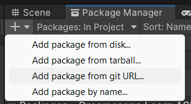
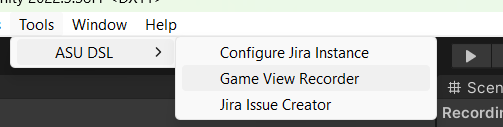
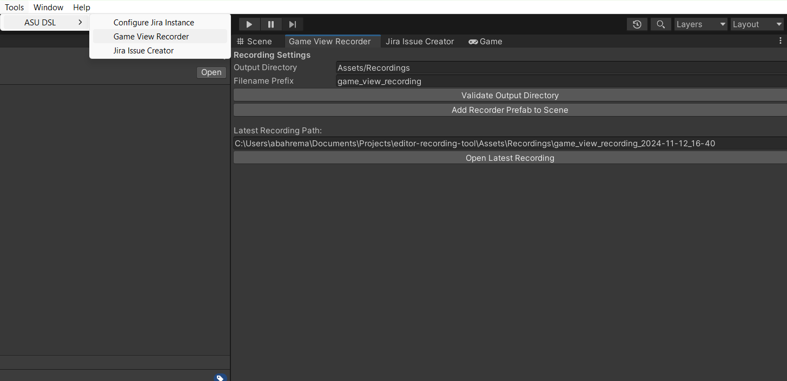
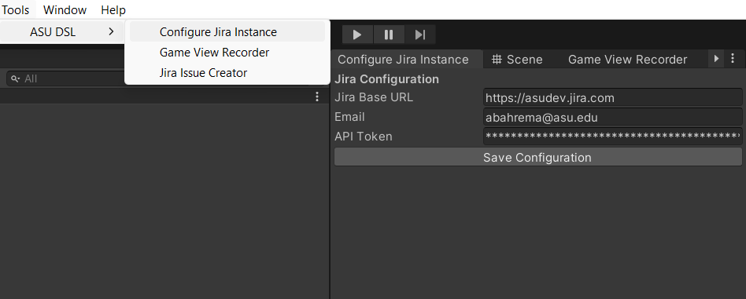
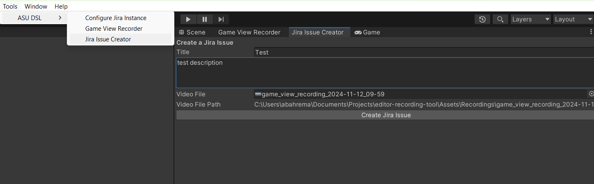

# Game View Recorder & Jira Integration Tool

## Overview
The **Game View Recorder & Jira Integration Tool** is a Unity Editor extension designed for streamlining the process of recording gameplay footage and reporting bugs to Jira. It includes:
- **Game View Recorder**: A flexible recording system to capture gameplay footage directly from the Unity Editor.
- **Jira Bug Reporting Tool**: Integrates Jira to enable bug reports with video attachments, titles, and descriptions.

## Features
- Record the Unity Game View directly, with customizable output paths and filenames.
- Save and manage recordings with validation of output directories.
- Define Jira workspace credentials and configure integration settings.
- Create detailed Jira issues, including titles, descriptions, and video attachments.

---

## Unity Installation

1. Open your Unity Package Manager
2. Add package from git url: https://github.com/asu-dsl/qa-recording-tool.git
   
   

## Game View Recorder

### Accessing the Tool
To access the Game View Recorder:
1. Navigate to `Tools > ASU DSL > Game View Recorder` in the Unity Editor menu.

   

2. The **Game View Recorder** window will appear:

   

### Recorder Settings
The **Game View Recorder** interface includes:
1. **Output Directory**: The path where recordings are saved. Specify the folder and validate its existence.
2. **Filename Prefix**: Define a prefix for generated filenames (e.g., `game_view_recording`).
3. **Validate Output Directory**: Ensures the output directory exists and creates it if necessary.
4. **Add Recorder Prefab to Scene**: Adds the recorder GameObject to the active scene and ensures it persists between scene loads.

### Workflow
1. **Configure Settings**:
   - Specify the `Output Directory`.
   - Set the `Filename Prefix`.
   - Click "Validate Output Directory" if needed.

2. **Add Recorder**:
   - Click "Add Recorder Prefab to Scene".
   - The recorder is marked as `DontDestroyOnLoad`, allowing it to persist across scenes.

3. **Start Recording**:
   - Use the recorder to capture gameplay footage.

---

## Jira Integration

### Jira Configuration
To configure Jira:
1. Navigate to `Tools > ASU DSL > Configure Jira Instance`.

   

2. Enter the following details:
   - **Jira Base URL**: The URL of your Jira instance (e.g., `https://yourcompany.jira.com`).
   - **Email**: The email associated with your Jira account.
   - **API Token**: Your Jira API token for authentication.

3. Click **Save Configuration** to store the credentials.

### Creating a Jira Issue
To create a Jira issue:
1. Navigate to `Tools > ASU DSL > Jira Issue Creator`.

   

2. The **Jira Issue Creator** interface includes:
   - **Title**: Provide a concise issue title.
   - **Description**: Add a detailed description of the bug.
   - **Video File**: Attach a recorded video by dragging it into the field or selecting a file path.

3. Click **Create Jira Issue** to submit the bug report.
   - The tool will authenticate with Jira and upload the bug report, including the video attachment.

---

Feel free to suggest improvements or report issues directly in this repository. Placeholder screenshots will be replaced with finalized images in the upcoming release.
